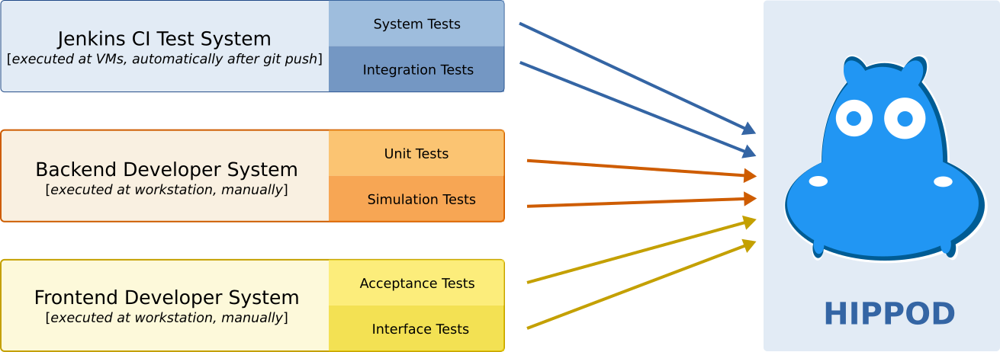
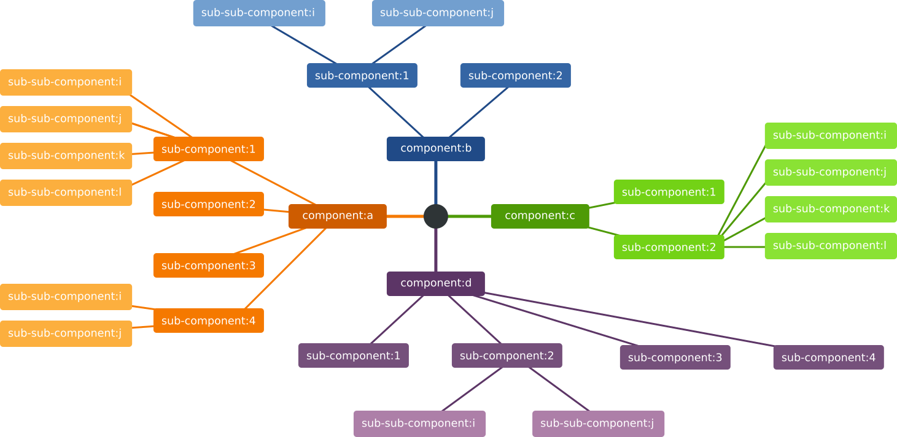
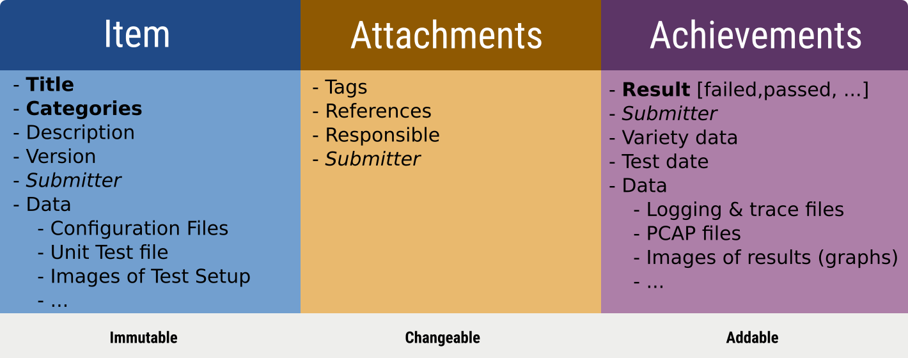

# Problem Statement

Larger software projects often utilize many different test systems. Each test
system/product comes with its own reporting tool, making it difficult to get an
unified view across this heterogeneous test landscape for specific software
versions. With Hippod tests are still executed with your currently best suited
tools. Hippod collects, harmonizes & manages your tests!



# Features

- **Simplicity**, number one design decision was that interactions with hippod are
	nearly invisible. You even need no unique test number, a title & category are
	enough.
- **Traceability**, unlike any known test system Hippod identifies tests based on
	the content, not on "unique numbers". If a test changes, e.g. a variable in
	the test, hippod detects this. If a test is stored in hippod you will
	exactly know what the test was, including the exact test environment and used
	source code. See more in the Traceability section.
- **Manageable**, managing test databases is cumbersome. Outdated & invalid tests
	still in the database requires human ressourcs. Hippod includes a garbage
	mechanism, trying to remove outdated entries automatically.
- **Scalability**, larger test systems can contain thousands of tests. Hippod
	was designed with this requirement in mind. Where possible, the complexity of
	algorithms was designed to be O(1) - so running in constant time no matter
	how many entries are in the database.
- **Powerful export capabilities**, the integrated web-gui is the management
	console to see the status of all tests. Sort them, limit, filter for teams or
	tags, etc. To provide reports hippod can export to several formats like PDF
	or even ePUB.

# Traceability

Traceability, trust & non-modifiable results are some of the most important
characteristics of a test database. If you cannot connect a given test result
with a given test, your data is pointless. Hippod provides mechanisms to attach
as much environment data as possible to uniquely identify a test. It is up to
you to you decide which is important. Some examples:

- **Test scripts/program**, for example, for Unit Tests you want to attach the
	complete Unit Test file. Even after years it is possible to check what
	exactly was tested and how. This additional layer of traceability is unique
	to Hippod.
- **Test Environment**, e.g. when using a Simulator you want to attach specific
	version information. E.g. the simulation program version. Another example is
	the Operating System version. For some test it indispensable to distinguish
	between Windows and Linux (e.g. compiler tests). For Web Gui Tests the
	Operating system is not of interest that much, rather the Browser version is
	important here. Another example is hardware tests: if you test includes a
	bunch of different hardware architectures, you should account this too.
- **Source Code**, sure, *which* software version was tested is
	important. This can be specified by specifying so called *anchors*.

Hippod is really flexible and leaves the decision to you what is important and
what not.

## How Traceability Works

Tests are grouped and identified by *title* and *category*. Both information is
mandatory. The category is a list can be freely defined, a suggestion is that
you form the categories hierarchical:



On a concrete example:

```
[ "team:a", "os", "network" ]            <- network tests, not firewall/routing related
[ "team:a", "os", "network", "firwall" ] <- tests for firwall component
[ "team:a", "os", "network", "routing" ] <- routing related tests
[ "team:b", "web-gui" ]                  <- overall web-gui tests
[ "team:b", "web-gui", "portal" ]        <- web-gui but in the area of portal component
```

The advantage in defining categories in this way is an easy identifcation:

- which sub-system has good/bad test coverage?
- which sub-system is frequently tested, which not?
- current status of test results (failed/passed) limited to sub-systems?
- ...


Hippod calculates a SHA1 sum over all provided information. The more
information you provide about the test & test environment, the tighter the
definition of a test.


# Integration Into Existing Test Infrastructure

Hippod speaks REST - so you can use your programming language of choice to feed
Hippod with test data and results. If your test system is written in
Python/Swift/Go with built-in HTTP/JSON support it is a trivial to connect your
test-system and Hippod. If you use plain C, you probably want to use one of our
existing Python based adapter.

A minimal - but complete - example including title, description, category, tags
and result is illustrated in the next lines (be aware: normally you will hide
these details in a separate library so that you have even fewer hippod specific
code):

```
#!/usr/bin/env python
import json
import requests

hippo_url = 'http://localhost:8080/api/v1/object'
test_data = """
{
  "submitter" : "john_doe",
  "object-item" " {
    "title" : "This is my first test",
    "categories" : [ "team:orange", "topic:ip", "subtopic:route-cache" ],
    "tags" : [ "ip", "route", "network" ],
  }
  "achievements" : [
    { 'result' : 'passed', 'test-date' : '2016-01-01' }
  ]
}
"""
headers = {'Content-type': 'application/json', 'Accept': 'application/json'}
r = requests.post(hippo_url, data=test_data, headers=headers)
print("Result {}".format(r.json()))
```

# What is a Test - Hippod Test Object Anatomy?

Hippod tests are divided in three components, determining the structure of tests:

- Test Object
- Test Attachments
- Test Achievements

Test Objects determine the identifyable, unique part of tests. If values change
here the test ID will change. Test Attachments are modifyable and enrich the
test with additinal information. If Test Attachments change, this do not change
the test ID. So attachments like *tags* or *responsible* can change at any time.
Test Achievements represent the test result (passed, failed, ...) and
additional information related to the particular test run. For example, if log
files are generated or PCAP files are captured, this can be added to the Test
Achievements. Each new test will add a new achievement and after 1000 test runs
a test will have 1000 achievements.

Required attributes:

- title
- category
- submitter
- author
- test result

Optional attributes:

- tags
- requirements





# Requirement Engineering

If a more formal process is required that Hippod provides the possibility to
add requirement information to tests. If a test failed, these formal
requirements are not fulfilled. The requirements field is freely defineable and
interacts nicely with your requirement system.


# Installation

Hippod is written in Python3 using asyncio/aiohttp. To generate PDF reports
pandoc/xetex is required. For LDAP functionality libldap is required. Hippod
is tested on Debian/Ubuntu and Arch Linux. For Debian based systems the following
three lines should install all required dependencies:

```
sudo apt-get install python3-pip libsasl2-dev pandoc texlive-xetex
sudo apt-get install texlive-latex-extra texlive-latex-recommended libldap-dev
sudo pip3 install -r requirements.txt
```

To install hippod the next lines should do the trick:

```
# clone and install runtime files
git clone https://github.com/hgn/hippod.git
cd hippod
sudo make install

# edit configuration for LDAP support, if not defaults are fine
vim /etc/hippod/hippod-configuration.json

# start and enable hippod with systemd
sudo systemctl daemon-reload
sudo systemctl start hippod
sudo systemctl enable hippod

# follow logfile
sudo journalctl -f -u hippod
```

Point you web browser to http://localhost:8080/ - that's all.

# Bug Reports? Further questions? Contact?

Open a new issue at GitHub directly: https://github.com/hgn/hippod/issues

For all other requests you can contact the author: Hagen Paul Pfeifer <hagen@jauu.net>


# Licence

Simple MIT licensed. Install where you want and how often you want. Don't be
afraid to operate Hippod in your company. If you make a product out of Hippod -
great! The only request is that the LICENSE file must be intact, that's all.

# Privacy Statement

Hippod will never query external resources like Java Script libraries or Google
Fonts. All resources are stored within hippod. This was one major design
decision: never leak data to third party sides. Hippod can be operated behind
cooperate firewalls/proxies. Your privacy is important to us!

